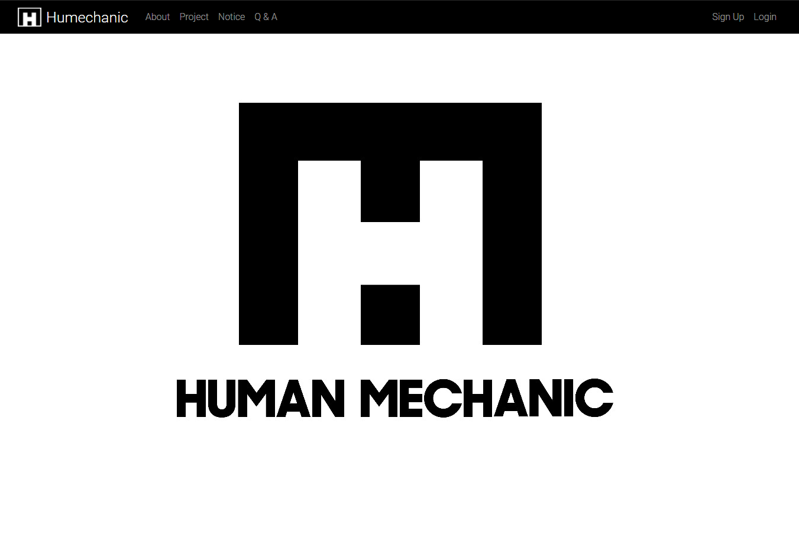
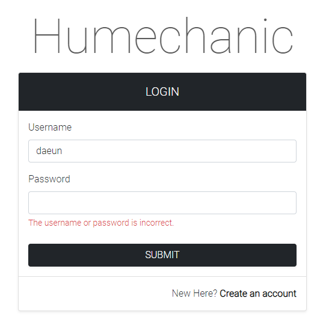
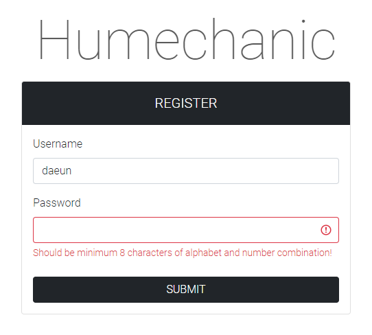
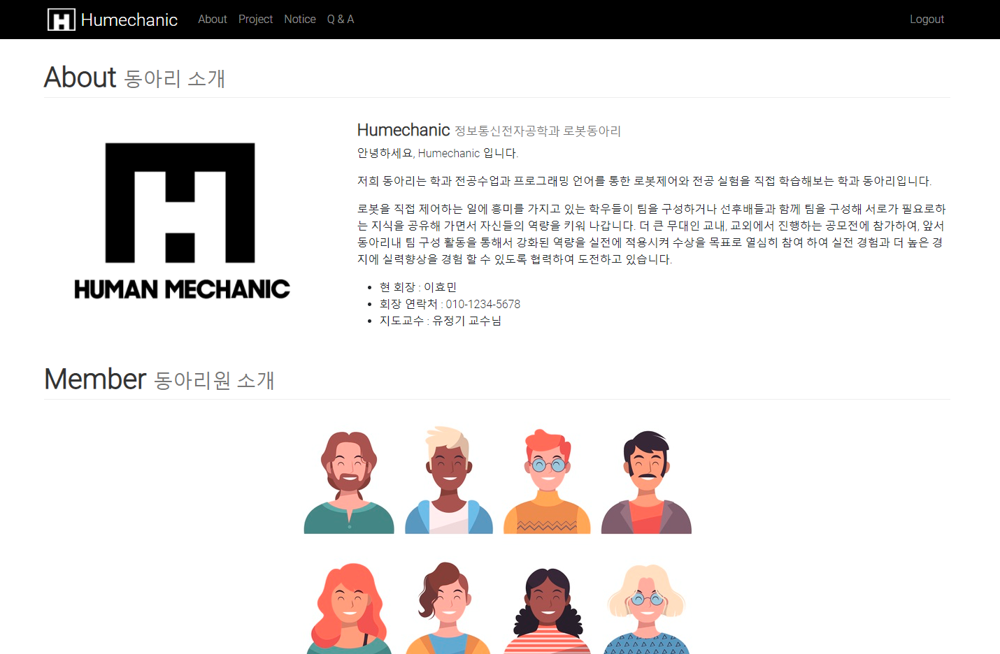
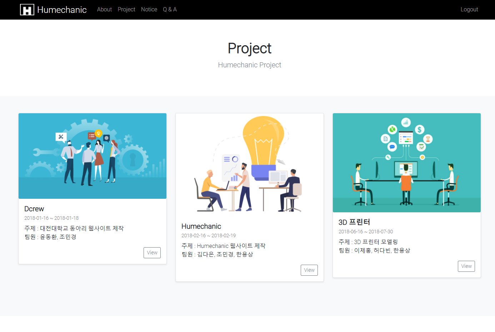
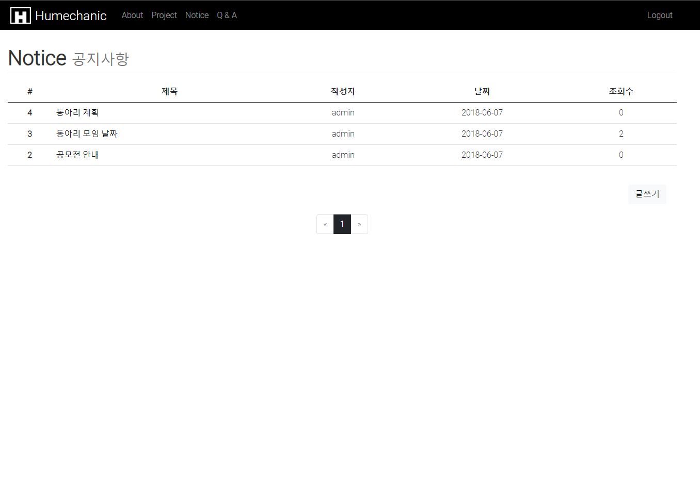
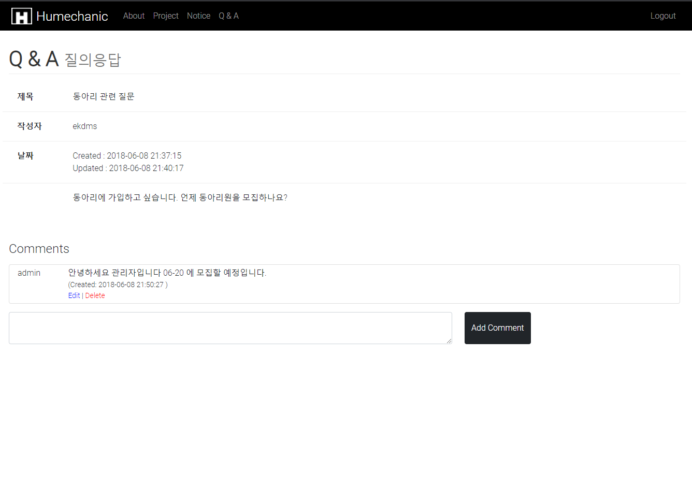

# Humechanic

학과 내 동아리인 로봇 동아리 홈페이지를 만들어 보았습니다.

## Stack

- HTML/CSS
- JavaScript
- Bootstrap
- MongoDB / Mongoose
- NodeJS (Express)

## Features

- 로그인 및 회원가입
- User 접근 제한 및 유효성 확인
- 게시판 작성, 수정, 삭제
- 게시판 페이지, 댓글 기능

## Run Project

```bash
npm install
nodemon
```

## Screenshot

### Home

</img>

### Login & Register

</img>
</img>

### About

</img>

### Project

</img>

### Notice

</img>

### Q & A

</img>
